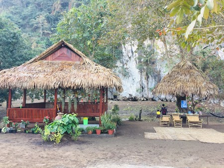
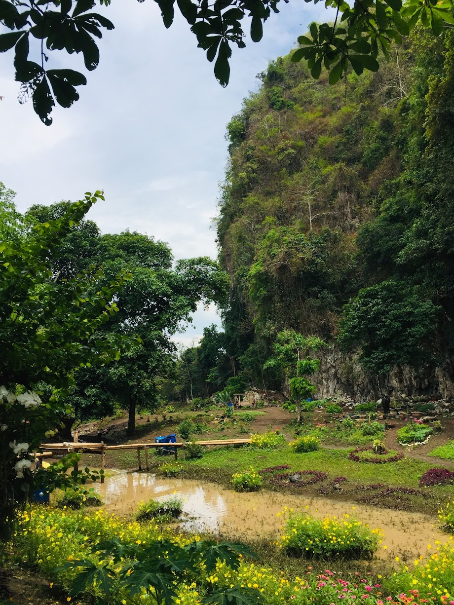
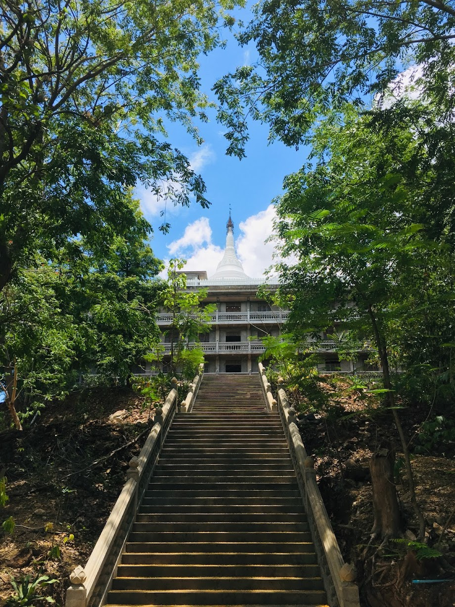
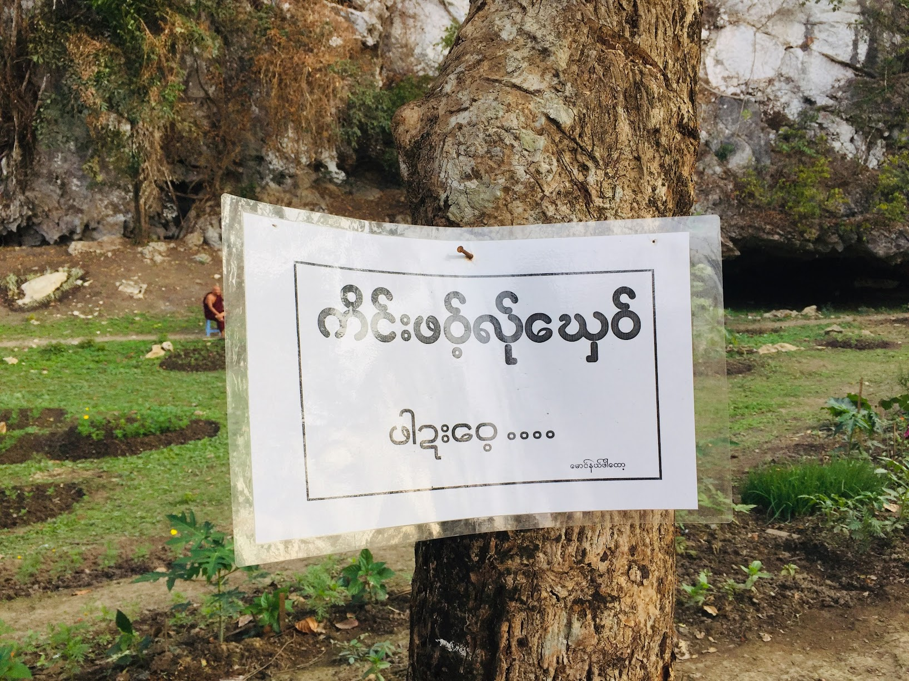
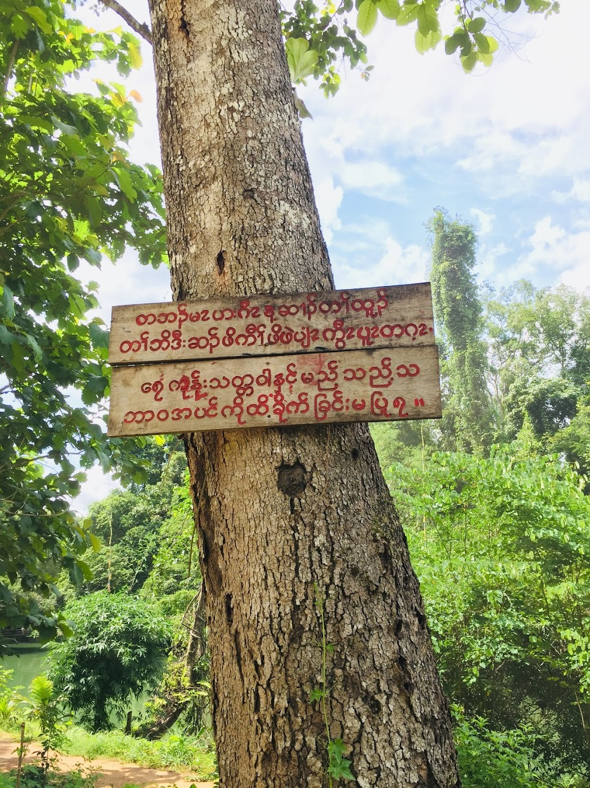

### Hi there 👋 အ်ှဆံင်းလာဆာ် ကိုဝ်ဟှာဍေ 👋 မင်္ဂလာပါ။ 
Hpa-An (ဍုံထ်ုအင်), Kayin State (ဖၠုံထီ့ခါန်ႋ) , Republic of the Union of Myanmar 🇲🇲

<table>
    <thead>
        <tr>
<!--             <th>column-1</th> -->
<!--             <th>column-2</th> -->
        </tr>
    </thead>
    <tbody>
        <tr>
            <td rowspan=2>  
              Taung Wine Sanctuary
            </td>
            <td rowspan=4>   
              Taung Wine Sanctuary  
                
               
            </td>
        </tr>
        <tr>
          <td rowspan=4>  
            Mya Yadanar Pagoda,   Taung Ga Lay Monastery  
        </tr>
        <tr>
          <td rowspan=4>  
              Taung Wine Sanctuary
               
               
               
          </td>
        </tr>
    </tbody>
</table>

<!-- Mya Yadanar Pagoda, Taung Ga Lay Monastery  -->

<!--  -->

"Do no harms to Fauna and Flora"  
Dooplaya District (ဒူပျၥ်ယၥ် ကီၢ်ရ့ၣ်), Kawthoolei (ကီၢ်သူလ့ၤ)   

<!--  -->

<!--
**sawthinkar/sawthinkar** is a ✨ _special_ ✨ repository because its `README.md` (this file) appears on your GitHub profile.

Here are some ideas to get you started:

- 🔭 I’m currently working on ...
- 🌱 I’m currently learning ...
- 👯 I’m looking to collaborate on ...
- 🤔 I’m looking for help with ...
- 💬 Ask me about ...
- 📫 How to reach me: ...
- 😄 Pronouns: ...
- ⚡ Fun fact: ...
-->
